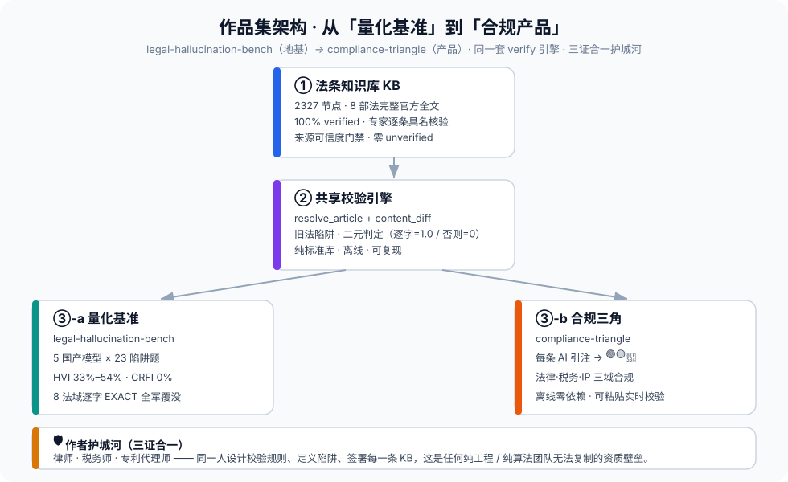
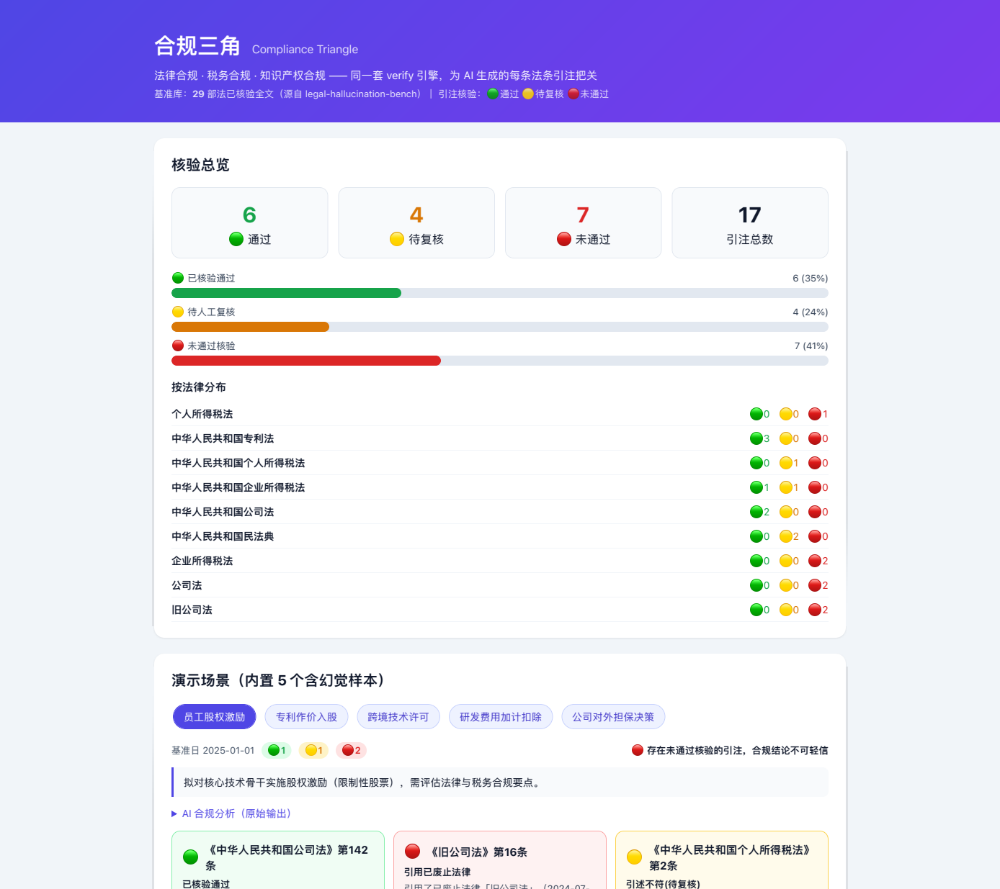

# 合规三角 · Compliance Triangle

> 🌏 English version: [README_EN.md](./README_EN.md).

> 企业三域合规助手（法律合规 · 税务合规 · 知识产权合规），由**同一人**——律师 / 税务师 / 专利代理师——签字背书。
> 所有 AI 生成的法条引注都经过**存在性 / 时效性 / 内容匹配**三层校验，不过门禁的红框标出。

> 📦 **双仓库作品集 · 产品篇** —— 地基是 [`legal-hallucination-bench`（私有仓库 · 需授权访问）](https://github.com/vickywu97/legal-hallucination-bench)（量化"AI 法律引注幻觉"的离线基准）。完整叙事 / 电梯演讲见 [`docs/PORTFOLIO.md`（私有仓库 · 需授权访问）](https://github.com/vickywu97/legal-hallucination-bench/blob/master/docs/PORTFOLIO.md)。

> 🚀 **在线体验（自包含静态页）**：`docs/index.html` 双击即用（无需安装/联网）。也可部署为永久公开链接：
> - **GitHub Pages**：仓库 Settings → Pages → Source 选 `Deploy from a branch` → `master` 分支、`/docs` 目录。启用后地址为 **https://vickywu97.github.io/compliance-triangle/** （注意：需先启用才会生效；且该 `github.io` 地址在中国大陆通常不可达，建议同时保留 `docs/index.html` 离线文件供直接打开）。
> - 其他静态托管（Vercel / Netlify / Cloudflare Pages）直接上传 `docs/index.html` 即可。
> 本地服务：`python3 -m compliance_triangle.web`（优先用同级 Bench KB；单独 clone 时自动降级为内置 vendor 快照）。

---

## 产品叙事（作品集核心）

我先用量化基准 [`legal-hallucination-bench`（私有仓库 · 需授权访问）](https://github.com/vickywu97/legal-hallucination-bench)
**证明了 AI 在法律引注上不可信**（5 模型 HVI 33.3%–54.2%，8 法域逐字 EXACT 合规率全为 0%）；
然后用**同一套 verify 引擎**构建了合规三角——让 AI 生成的每条法条引注都经过校验，
**不过门禁的红框标出**。这不是「会用 AI」，而是「知道 AI 哪里会出错，并设计了系统来防止」。

## 三大合规支柱

| 支柱 | 资质 | 覆盖法律（复用 Bench KB） |
| --- | --- | --- |
| 法律合规 | 律师 | 公司法、民法典、刑法 |
| 税务合规 | 税务师 | 企税、个税、增值税、税收征管 |
| 知识产权合规 | 专利代理师 | 专利法（后续扩展商标/著作权） |

## 引注核验徽章（🟢🟡🔴）

| 徽章 | 含义 |
| --- | --- |
| 🟢 已核验通过 | 法条存在且在有效期内 |
| 🟡 待人工确认 | 法条真实，但引述内容与官方有差异（概括/意译/遗漏但书） |
| 🔴 未通过核验 | 条文不存在/未生效，或引用了已废止法律（旧公司法/合同法等） |

## 架构（最大化复用 Bench 资产）

- **法条 KB**：只读 `legal-hallucination-bench` 的 `statutes.jsonl`（2327 节点全文本，8 部法），本仓库不存法条。
- **校验引擎**：直接复用 `benchmark/verify.py` 的 `resolve_article` + `content_diff`，与基准共用「来源可信度门禁」。
- **LLM 接入**：`compliance_triangle/llm_adapter.py`（5 个国产模型 OpenAI 兼容层，密钥走环境变量）。

> **运行时依赖说明（诚实）**：本仓库运行期优先读取同级 `legal-hallucination-bench` 的法条 KB（通过 `COMPLIANCE_TRIANGLE_BENCH` 环境变量或同级目录解析），以获得最新数据；**同时内嵌一份 vendor 快照**（`compliance_triangle/vendor/bench_kb/`，2327 节点 / 8 部法），因此即使单独 clone compliance-triangle 也能直接运行。所谓「离线零依赖」严格成立的是**预生成的静态展示页** `docs/index.html`（双击即用、不连任何服务）。

> **数据覆盖说明（诚实）**：增值税法（VAT_LAW）共 **38 条**（主席令第四十一号公布，2026-01-01 施行——"41" 是**公布令号**，并非条文数），KB 已全数逐字核验，无缺漏。8 部法均为完整官方全文。

> 与地基仓库的"地基 → 产品"关系图：
> 

## 免责声明
> ⚠️ 本工具（合规三角）仅对 AI 生成的法条引注做**存在性 / 时效性 / 内容匹配**的自动化校验，**不构成法律意见、税务意见或专利意见**，也不能替代执业律师、税务师、专利代理师的专业判断。校验结果（🟢🟡🔴）仅反映引注与官方法条文本的匹配情况，不保证任何合规结论的正确性或适用性；使用者应就具体事项咨询持证专业人士。工具引用的法条文本来自公开官方来源，评测结论为自动化判分结果，可能因法条更新或提取误差存在偏差，请以官方最新公布文本为准。

## 快速开始

```bash
# 1) 把 Bench 仓库作为同级目录克隆（或设置环境变量指向它）
#    注：Bench 为私有仓库，需先获授权并配置 Git 凭证（SSH 或 token）才能克隆
git clone https://github.com/vickywu97/legal-hallucination-bench.git ../legal-hallucination-bench

# 2) 离线演示（无需 API Key / 网络）：跑 5 个内置场景，生成合规备忘录 + 静态展示页
python demo/run_demo.py
# -> 合规备忘录: demo/output/S1..S6_*.md
# -> 静态展示页: docs/index.html  （双击即可在浏览器打开，零依赖、离线）
```

演示场景均内置「含幻觉」的预置回答，直接展示校验层如何拦截虚构条号与已废止法名。

### Phase 2 前端 · 两种打开方式

**A. 纯静态展示页（推荐先看这个，双击即用）**
`docs/index.html` 是一个**自包含、零外部依赖、可离线**的单文件页面：
- 顶部「核验总览」：🟢🟡🔴 计数 KPI + 占比条 + 按法律分布；
- 6 个演示场景分页签切换，每条引注渲染为彩色卡片（🟢通过 / 🟡待复核 / 🔴未通过），
  并展示「AI 引述 vs 官方原文」对照；
- 直接在文件管理器双击打开即可，**不需要启动任何服务**。

> 仪表盘长这样（基于真实 demo 数据生成的预览图，完整交互页请打开 `docs/index.html`）：
> 

**B. 本地交互服务（粘贴你自己的 AI 回答实时校验）**
零第三方依赖，仅用 Python 标准库 `http.server`：

```bash
python -m compliance_triangle.web            # 默认 http://127.0.0.1:8000
PORT=8080 python -m compliance_triangle.web  # 自定义端口
```

打开浏览器后，在「实时校验」区粘贴任意 LLM 生成的合规分析（含《法律》第X条引注），
点击「运行校验」，系统会用同一套 verify 引擎逐条核验并返回 🟢🟡🔴 结论。
（该页也内置了上面的 6 个演示场景展示。）

## 实时调用 LLM 并自动校验（已接通）

除「粘贴 AI 回答再校验」外，本产品已把 `llm_adapter` + `prompt_template` 串成端到端流程：
**填场景 → 调国产模型生成分析 → 同一套 verify 引擎逐条核验**。两种方式任选：

**① 命令行（CLI）**

```bash
# 需先配置对应模型密钥（见下方环境变量）
python -m compliance_triangle.live \
    --scenario "公司拟为关联方提供大额保证担保，需确认决议程序与违约救济" \
    --as_of 2025-01-01 --model DeepSeek-V3 --out memo.md
```

未指定 `--model` 时自动取第一个已配置密钥的模型；无密钥则明确报错退出（**不会静默失败**）。

**② Web 端点 `/analyze`**

启动 `python -m compliance_triangle.web` 后，在「实时校验」区选择模型并填写场景，
点击「调用模型并校验」，服务会调用模型并将返回结果直接送入校验层（前端自动渲染 🟢🟡🔴）。

模型密钥从环境变量读取（不硬编码，缺密钥时自动降级为「仅粘贴校验」模式，页面顶部给出提示）：
`DEEPSEEK_API_KEY` / `ZHIPU_API_KEY` / `DASHSCOPE_API_KEY` / `MOONSHOT_API_KEY`。
支持的 5 个模型见 `config.MODELS`（DeepSeek-V3 / DeepSeek-R1 / GLM-4-Flash / Qwen-Max / Kimi）。

## 测试（Test suite）

零依赖（`unittest`，仅标准库）。KB 相关用例需同级 `legal-hallucination-bench`：

```bash
python -m unittest discover -s tests -v
```

覆盖：引注解析边界（无『条』、英文法名、续列、嵌套、引述冒号）、verify 三层校验、
KB 计数（8 部法 / 2327 条）、Web 渲染降级与实时模型可用性门禁、实时调用流水线（mock 模型）。

## 已知限制 / Known Limitations

- **信任分级暂未启用**：Bench 在 v1.3 将 2327 个节点全部升为 `verified`，因此本产品的「Tier A 专家逐条签核 / Tier B 官方提取未签核」分级门禁当前恒为真、不呈现。产品核验的是**存在性 / 时效性 / 内容逐字一致性**，而非逐节点 provenance 分级。
- **增值税法覆盖 38/38 条**（现行全文，已于 KB 逐字核验，无缺漏；"主席令第四十一号" 是公布令号，非条文数）。
- **运行时依赖 Bench KB**（见上「运行时依赖说明」）。
- 引注解析已覆盖常见边界：不含「条」字（第一百四十二条）、英文法名（《Company Law》Article 142）、续列（《公司法》第15条、第142条）、嵌套书名号、引述冒号接原文等；极冷门的写法仍可能漏解析，相关引注会判「未找到」而非误判通过。

## Validated by（早期用户验证）

> 面向执业律师 / 税务师 / 专利代理师的真实试用反馈（早期验证，非商业背书）。
> 回收模板与回填说明见仓库内 `用户验证-合规三角.md`。

<!-- 待回填：把 1–3 条有代表性的同行反馈贴在此处，格式：
> 姓名 / 身份（如：执业律师，X 年公司法）— 一句话评价（如：对公司法引注的 🟡/🔴 判定准确，未发现误杀）。
-->

## 路线图

- Phase 1（后端骨架）：场景输入 → LLM → verify 校验 → 结构化 JSON ✅ 演示可用
- Phase 2（前端）：合规备忘录 UI + 引注核验可视化 ✅
  - 自包含静态展示页 `docs/index.html`（离线、零依赖、双击即用）
  - 零依赖本地服务 `python -m compliance_triangle.web`（实时粘贴校验 `/verify`）
- Phase 3（作品集化）：独立 README / 互链 / 架构图 / 预览图 / 跨仓库联动 ✅
- 实时调用 LLM 并自动校验（`compliance_triangle/live.py` + Web `/analyze` 端点 + CLI）✅
- 引注解析边界加固 + 零依赖测试套件（`tests/`）✅
- 可信度修复（空回答误报🟢、KB 缺失优雅降级、VAT 覆盖标注、hero 计数）✅

## 授权

MIT
