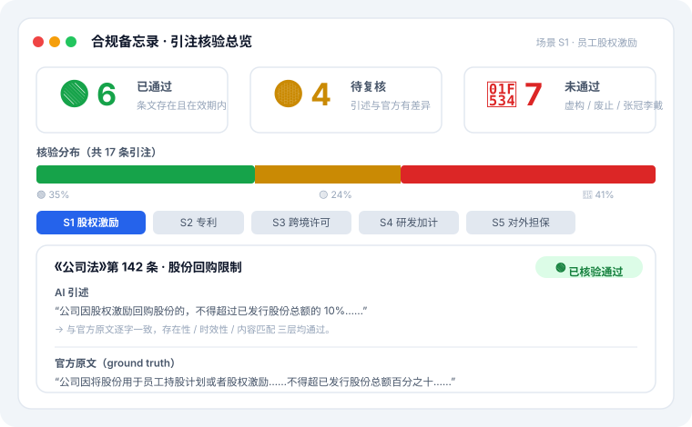

# 合规三角 · Compliance Triangle

> 企业三域合规助手（法律合规 · 税务合规 · 知识产权合规），由**同一人**——律师 / 税务师 / 专利代理师——签字背书。
> 所有 AI 生成的法条引注都经过**存在性 / 时效性 / 内容匹配**三层校验，不过门禁的红框标出。

> 📦 **双仓库作品集 · 产品篇** —— 地基是 [`legal-hallucination-bench`](https://github.com/vickywu97/legal-hallucination-bench)（量化"AI 法律引注幻觉"的离线基准）。完整叙事 / 电梯演讲见 [`docs/PORTFOLIO.md`](https://github.com/vickywu97/legal-hallucination-bench/blob/master/docs/PORTFOLIO.md)。

---

## 产品叙事（作品集核心）

我先用量化基准 [`legal-hallucination-bench`](https://github.com/vickywu97/legal-hallucination-bench)
**证明了 AI 在法律引注上不可信**（5 模型 HVI 50%–64.6%，8 法域逐字 EXACT 合规率全为 0%）；
然后用**同一套 verify 引擎**构建了合规三角——让 AI 生成的每条法条引注都经过校验，
**不过门禁的红框标出**。这不是「会用 AI」，而是「知道 AI 哪里会出错，并设计了系统来防止」。

## 三大合规支柱

| 支柱 | 资质 | 覆盖法律（复用 Bench KB） |
| --- | --- | --- |
| 法律合规 | 律师 | 公司法、民法典、刑法 |
| 税务合规 | 税务师 | 企税、个税、增值税、税收征管 |
| 知识产权合规 | 专利代理师 | 专利法（后续扩展商标/著作权） |

## 引注核验徽章（🟢🟡🔴）

| 徽章 | 含义 |
| --- | --- |
| 🟢 已核验通过 | 法条存在且在有效期内 |
| 🟡 待人工确认 | 法条真实，但引述内容与官方有差异（概括/意译/遗漏但书） |
| 🔴 未通过核验 | 条文不存在/未生效，或引用了已废止法律（旧公司法/合同法等） |

## 架构（最大化复用 Bench 资产）

- **法条 KB**：只读 `legal-hallucination-bench` 的 `statutes.jsonl`（2327 节点全文本，8 部法），本仓库不存法条。
- **校验引擎**：直接复用 `benchmark/verify.py` 的 `resolve_article` + `content_diff`，与基准共用「来源可信度门禁」。
- **LLM 接入**：`compliance_triangle/llm_adapter.py`（5 个国产模型 OpenAI 兼容层，密钥走环境变量）。

> 与地基仓库的"地基 → 产品"关系图：
> 

## 快速开始

```bash
# 1) 把 Bench 仓库作为同级目录克隆（或设置环境变量指向它）
git clone https://github.com/vickywu97/legal-hallucination-bench.git ../legal-hallucination-bench

# 2) 离线演示（无需 API Key / 网络）：跑 5 个内置场景，生成合规备忘录 + 静态展示页
python demo/run_demo.py
# -> 合规备忘录: demo/output/S1..S5_*.md
# -> 静态展示页: demo/output/index.html  （双击即可在浏览器打开，零依赖、离线）
```

演示场景均内置「含幻觉」的预置回答，直接展示校验层如何拦截虚构条号与已废止法名。

### Phase 2 前端 · 两种打开方式

**A. 纯静态展示页（推荐先看这个，双击即用）**
`demo/output/index.html` 是一个**自包含、零外部依赖、可离线**的单文件页面：
- 顶部「核验总览」：🟢🟡🔴 计数 KPI + 占比条 + 按法律分布；
- 5 个演示场景分页签切换，每条引注渲染为彩色卡片（🟢通过 / 🟡待复核 / 🔴未通过），
  并展示「AI 引述 vs 官方原文」对照；
- 直接在文件管理器双击打开即可，**不需要启动任何服务**。

> 展示页长这样（示意，真实页面可交互、可离线打开）：
> 

**B. 本地交互服务（粘贴你自己的 AI 回答实时校验）**
零第三方依赖，仅用 Python 标准库 `http.server`：

```bash
python -m compliance_triangle.web            # 默认 http://127.0.0.1:8000
PORT=8080 python -m compliance_triangle.web  # 自定义端口
```

打开浏览器后，在「实时校验」区粘贴任意 LLM 生成的合规分析（含《法律》第X条引注），
点击「运行校验」，系统会用同一套 verify 引擎逐条核验并返回 🟢🟡🔴 结论。
（该页也内置了上面的 5 个演示场景展示。）

## 接入真实 LLM（可选）

```python
from compliance_triangle.prompt_template import build_messages
from compliance_triangle.llm_adapter import call_model, available_models
from compliance_triangle.verify_integration import verify_answer

msgs = build_messages("员工股权激励", "2025-01-01")
answer = call_model("DeepSeek-V3", msgs)   # 需设置 DEEPSEEK_API_KEY
result = verify_answer("S1", answer, "2025-01-01")
```

模型密钥从环境变量读取（不硬编码）：`DEEPSEEK_API_KEY` / `ZHIPU_API_KEY` /
`DASHSCOPE_API_KEY` / `MOONSHOT_API_KEY`。

## 路线图

- Phase 1（后端骨架）：场景输入 → LLM → verify 校验 → 结构化 JSON ✅ 演示可用
- Phase 2（前端）：合规备忘录 UI + 引注核验可视化 ✅
  - 自包含静态展示页 `demo/output/index.html`（离线、零依赖、双击即用）
  - 零依赖本地服务 `python -m compliance_triangle.web`（实时粘贴校验 `/verify`）
- Phase 3（作品集化）：独立 README / 互链 / 架构图 / 预览图 / 跨仓库联动 ✅

## 授权

MIT
